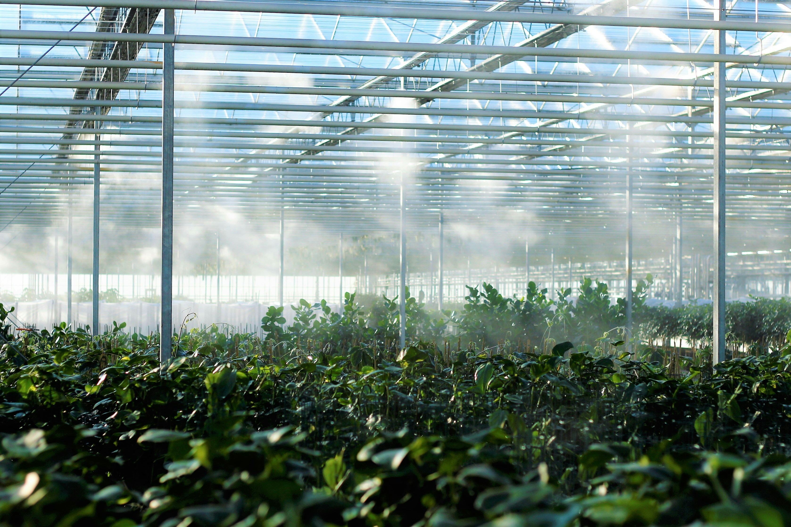

# ARES - Agricultural Resilient Systems by UltraCropCare®

## 🌱 Descripción

ARES (Agricultural Resilient Systems) es un sistema de riego inteligente 10 veces más duradero diseñado para entornos extremos. Nuestra tecnología avanzada permite diagnosticar pérdidas en minutos y cultivar donde otros no pueden.

## ✨ Características Principales

- **Mayor Durabilidad**: Hasta 10× más resistente que los sistemas convencionales
- **Diagnóstico Rápido**: Identifica problemas en minutos, no en días
- **Adaptado a Entornos Extremos**: Especialmente diseñado para condiciones agrícolas desafiantes
- **Eficiencia Mejorada**: Optimiza el uso de agua y recursos

## 🚀 Beneficios

- **+ 40%** Rendimiento de cultivos
- **↓ 70%** Reducción en costos de mantenimiento
- **↓ 90%** Menor tiempo de inactividad por problemas
- **12 años** De vida útil garantizada

## 🔧 Tecnología

ARES combina hardware duradero con software inteligente para crear un ecosistema de riego completo:

1. **Sistemas de Monitoreo Avanzado**: Sensores de alta precisión
2. **Análisis Predictivo**: Algoritmos que anticipan problemas antes de que ocurran
3. **Gestión Centralizada**: Control total desde cualquier dispositivo

## 📱 Contáctanos

¿Quieres saber cuánto estás perdiendo por no tener ARES de UltraCropCare?
Reserva una consulta gratuita con nuestro equipo.

- **WhatsApp**: [Iniciar chat](https://wa.me/56995800313?text=Hola%20equipo%20UltraCropCare%2C%20me%20gustar%C3%ADa%20conocer%20m%C3%A1s%20sobre%20ARES)
- **Email**: [patricio.arias@ultracropcare.com](mailto:patricio.arias@ultracropcare.com)

## 🌐 Síguenos

- [LinkedIn](https://www.linkedin.com/company/ultracropcare/posts/?feedView=all)
- [Instagram](https://www.instagram.com/ultracropcare/)
- [YouTube](https://www.youtube.com/@ancestraltechnologies3116)

---

© 2023 UltraCropCare® - Todos los derechos reservados 